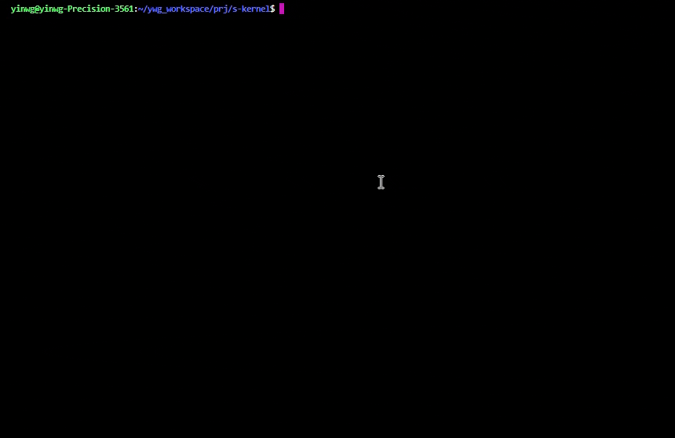

<p align="center">

</p>

# s-kernel 说明
		更新日期: 2025-03-17

## 简介

**s-kernel** 是一个小型的操作系统内核，用于学习操作系统内核原理。

----------------------------------------------------------------------

**功能特性**

- 支持时间片轮转及抢占式线程调度策略

- 实现了大块内存页分配机制及小块内存slab机制

- 支持mutex/mailbox/semaphore/message_queue等IPC通信方式

- 支持shell命令终端,支持top/version等内置命令，同时支持用户自定义命令

- 支持kernel定时器等功能特性

- 支持通用设备管理框架


## 使用

- 安装qemu

```
sudo apt update
sudo apt install qemu-system-aarch64
```

- 下载编译工具链

```
cd tools
python3 ./get_toolchain.py aarch64
source ./env_config.sh
```

- 编译s-kernel

```
make 
```

- 运行s-kernel

```
./run_os.sh
```




