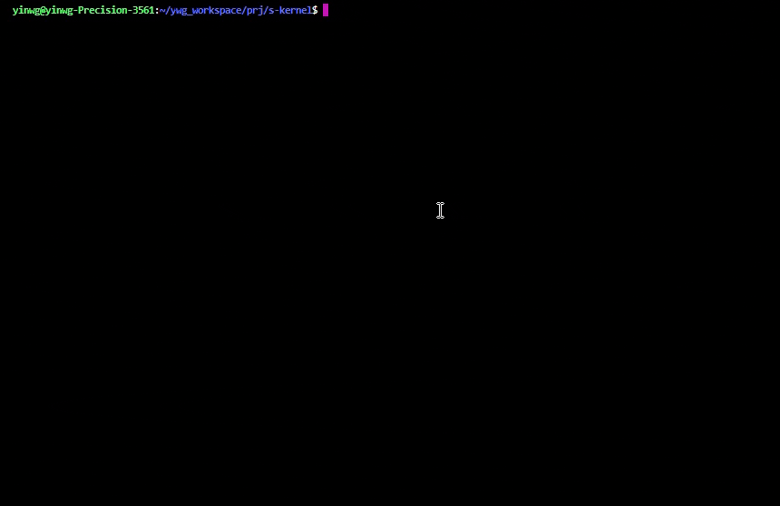

<p align="center">

</p>

# s-kernel 操作系统内核

<p align="center">

[](https://developer.arm.com/Architectures/AArch64)
[](LICENSE)
[]()

</p>

## 简介

**s-kernel** 是一个基于 ARMv8 (aarch64) 架构的小型操作系统内核，专为学习操作系统内核原理而设计。系统采用模块化架构，支持线程调度、内存管理、进程间通信、设备管理等核心功能。

## 目录结构

```
s-kernel/
├── arch/                  # 架构相关代码
│   └── aarch64/          # ARMv8 架构实现
│       ├── include/      # 架构头文件 (MMU、中断、上下文等)
│       └── src/          # 架构源码 (陷阱处理、内存管理、中断)
├── bsp/                   # 板级支持包
│   ├── driver/           # 板级驱动 (UART等)
│   └── include/          # BSP 头文件
├── thread/                # 线程管理与调度
├── mem/                   # 内存管理 (slab分配器)
├── ipc/                   # 进程间通信
│   ├── mutex.c           # 互斥锁
│   ├── semaphore.c       # 信号量
│   ├── event.c          # 事件
│   ├── mailbox.c        # 邮箱
│   └── msg_queue.c      # 消息队列
├── fs/                    # 文件系统
│   ├── vfs/             # 虚拟文件系统
│   └── file_system/     # 文件系统实现
├── driver/                # 通用设备驱动
│   └── serial/          # 串口驱动
├── common/                # 公共组件
│   ├── shell.c          # Shell 命令行
│   ├── cmd.c            # 命令管理
│   ├── ring_buffer.c    # 环形缓冲区
│   └── completion.c     # 同步完成机制
├── init/                  # 系统初始化
├── include/               # 内核头文件
├── scripts/               # 编译脚本
├── tools/                 # 工具链
└── user/                  # 用户测试程序
```

## 功能特性

### 线程调度
- 基于优先级的时间片轮转调度策略
- 支持抢占式调度，最多 32 级优先级
- 线程状态管理：初始化、就绪、运行、挂起、关闭
- 空闲线程自动调度

### 内存管理
- 大块内存页分配机制
- 小块内存 slab 分配器
- 动态内存分配与释放 (`sk_malloc`/`sk_free`)

### 进程间通信 (IPC)
| 组件 | 描述 |
|------|------|
| **Mutex** | 互斥锁，支持优先级继承 |
| **Semaphore** | 计数信号量，支持 FIFO/优先级模式 |
| **Event** | 事件标志，支持 AND/OR 逻辑运算 |
| **Mailbox** | 邮箱，支持阻塞/非阻塞发送接收 |
| **Message Queue** | 消息队列，支持可变大小消息 |

### 定时器
- 系统节拍定时器
- 支持单次和周期定时模式
- 线程级定时器支持

### Shell 命令行
- 内置命令：`top`（查看线程）、`version`（版本信息）等
- 支持用户自定义命令注册
- 环形缓冲区输入支持

### 设备管理框架
- 通用设备抽象层
- 支持设备类型：字符设备、块设备、网络设备
- 标准化设备操作接口（init/open/close/read/write/ioctl）
- 设备注册与查找机制

### 虚拟文件系统 (VFS)
- 统一文件操作接口
- 支持多种文件系统挂载
- 文件描述符表管理

## 快速开始

### 环境要求
- Linux 系统
- QEMU (支持 aarch64)
- Python 3
- GNU ARM 工具链

### 1. 安装 QEMU

```bash
sudo apt update
sudo apt install qemu-system-aarch64
```

### 2. 获取编译工具链

```bash
cd tools
python3 ./get_toolchain.py aarch64
source ./env_config.sh
```

### 3. 编译内核

```bash
make
```

### 4. 运行系统

```bash
./run_os.sh
```



## API 概览

### 线程操作
```c
struct sk_thread *sk_thread_create(const char *name, void (*entry)(void *param),
                                   void *param, sk_uint32_t stack_size,
                                   sk_uint8_t priority, sk_uint32_t tick);
sk_err_t sk_thread_startup(struct sk_thread *thread);
sk_err_t sk_thread_suspend(struct sk_thread *thread);
sk_err_t sk_thread_resume(struct sk_thread *thread);
```

### 内存操作
```c
void *sk_malloc(sk_size_t size);
void sk_free(void *ptr);
```

### IPC 操作
```c
// Mutex
struct sk_mutex *sk_mutex_create(const char *name, sk_uint8_t flag);
sk_err_t sk_mutex_lock(struct sk_mutex *mutex, sk_int32_t time);
sk_err_t sk_mutex_unlock(struct sk_mutex *mutex);

// Semaphore
struct sk_sem *sk_sem_create(const char *name, sk_uint16_t value, sk_uint8_t flag);
sk_err_t sk_sem_wait(struct sk_sem *sem, sk_int32_t time);
sk_err_t sk_sem_post(struct sk_sem *sem);

// Mailbox
struct sk_mailbox *sk_mailbox_create(const char *name, sk_size_t size, sk_uint8_t flag);
sk_err_t sk_mailbox_send(struct sk_mailbox *mb, sk_ubase_t value);
sk_err_t sk_mailbox_recv(struct sk_mailbox *mb, sk_ubase_t *value, sk_int32_t timeout);
```

### 定时器操作
```c
struct sk_sys_timer *sk_timer_create(const char *name, void (*timeout)(void *param),
                                      void *param, sk_tick_t tick, sk_uint8_t flag);
sk_err_t sk_timer_start(struct sk_sys_timer *timer);
sk_err_t sk_timer_stop(struct sk_sys_timer *timer);
```

## 开发指南

### 添加新命令
在 `common/cmd.c` 中注册命令：

```c
int cmd_xxx(int argc, char **argv)
{
    // 命令实现
    return 0;
}

CMD_EXPORT(xxx, cmd_xxx, "description");
```

### 添加新设备
参考 `driver/serial/serial.c` 实现设备驱动，使用设备注册接口：

```c
sk_err_t sk_device_register(struct sk_device *dev, const char *name, sk_uint16_t flag);
```

## 许可证

本项目基于 **GPL-2.0** 许可证开源。
